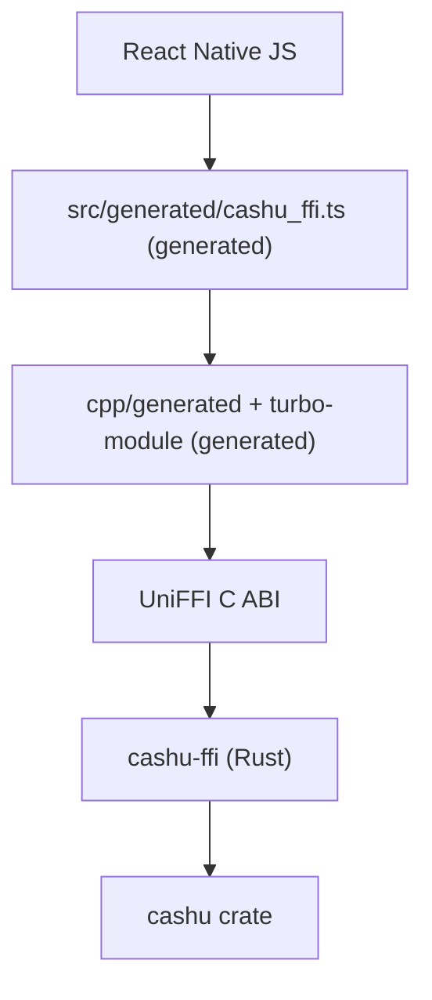

# @cashu/cashu-native

Native cashu crypto for React Native. The Rust [`cashu`](../../crates/cashu)
crate reaches JavaScript through [UniFFI][uniffi] and
[`uniffi-bindgen-react-native`][ubrn], and every layer between the two is
generated: the TypeScript, the JSI C++, the turbo-module glue, the podspec and
the Android build files.

It exists so [cashu-ts][cashu-ts] can hand its slowest work to Rust without
changing its public API. `NativeOutputDataCreator` implements cashu-ts's
`OutputDataCreator` interface, and a wallet opts in by passing it in.

## Installing it

The package deploys to its own repository, the way the Go binding does, so
install it from a tag rather than npmjs:

```sh
npm install github:cashubtc/cashu-native#v0.18.0
```

A `postinstall` script fetches the iOS xcframework and the Android jniLibs from
that release and checks them against the committed `checksums.sha256`. If you
install with `--ignore-scripts`, run it yourself:

```sh
node node_modules/@cashu/cashu-native/scripts/fetch-binaries.mjs
```

## Using it

```ts
import { Wallet } from '@cashu/cashu-ts';
import { uniffiInitAsync } from '@cashu/cashu-native';
import { NativeOutputDataCreator } from '@cashu/cashu-native/creator';

await uniffiInitAsync();

const wallet = new Wallet(mint, {
  outputDataCreator: new NativeOutputDataCreator(),
});
```

The low-level bindings are available too, and the root entrypoint does not
import cashu-ts, so this path works without it installed:

```ts
import { createDeterministicOutputs } from '@cashu/cashu-native';

const outputs = createDeterministicOutputs([16n, 8n, 4n], seed, counter, keysetId);
```

cashu-ts is an optional peer dependency. Install it alongside this package only
if you import `@cashu/cashu-native/creator`.

Only output construction moves native. `toProof` stays on cashu-ts's own
`OutputData`, so the amount binding, DLEQ and NUT-28 checks that protect a
wallet against a malicious mint are the reviewed ones.

`NativeOutputDataCreator` falls back to cashu-ts for the locks the native
surface does not express: HTLC locks, NUT-28 blinded keys, and caller-supplied
extra tags. Pass your own fallback to the constructor to change that.

## Architecture



Only `src/creator.ts`, `src/NativeOutputDataCreator.ts`, the tests and the
`example/` app are hand-written. Everything under `src/generated/`, `turbo/`,
`cpp/`, `ios/`, `android/`, plus the podspec and the xcframework, is emitted by
`just binding-react-native` and is not committed.

`turbo/` exists because React Native's codegen scans `codegenConfig.jsSrcsDir`
recursively. Pointed at the package root it walks `node_modules` and the
example app and finds nothing; pointed at `turbo/` it finds the one spec.

## Example app

`example/` is a plain React Native app that wires cashu-ts to this package and
shows the result. It is the proof the module links and runs, not just compiles.

```sh
just binding-react-native-ios      # build the Rust and the xcframework
cd bindings/react-native/example
npm install
(cd ios && pod install)
npm start                          # Metro, in one terminal
npm run ios                        # in another
```

Measured on an iPhone 17 simulator, where Hermes is a good deal slower than
Node: a 500-counter NUT-09 restore goes from 7071 ms to 68 ms, and the outputs
are byte-identical to cashu-ts.

### cashu-ts needs a TextDecoder polyfill on Hermes

This is not specific to this package, but any React Native app using cashu-ts
hits it. Hermes ships no `TextEncoder` or `TextDecoder`, and cashu-ts builds
its decoder with `{ ignoreBOM: true, fatal: true }`, which the smaller
polyfills silently ignore and then throw on. `@zxing/text-encoding` implements
both options. Install it and assign the globals before anything imports
cashu-ts, as `example/index.js` does:

```js
import { TextDecoder, TextEncoder } from '@zxing/text-encoding';

globalThis.TextDecoder ??= TextDecoder;
globalThis.TextEncoder ??= TextEncoder;
```

## Working on it

```sh
just binding-react-native          # regenerate everything from the Rust exports
just test-react-native             # cargo tests, typecheck, and cashu-ts parity
just bench-react-native            # native vs cashu-ts
just binding-react-native-ios      # xcframework
just binding-react-native-android  # one .so per ABI, plus the alignment check
just test-react-native-ios         # build the example for a simulator
just test-react-native-android     # build the example for an emulator
```

Android needs an NDK and `cargo-ndk`; `nix develop .#react-native-android`
provides both. The Rust links as a shared library, so each ABI ships a ~2.5 MB
`libcashu_ffi.so` rather than a ~48 MB static archive.

The parity tests run the same generated bindings React Native gets, through
ubrn's N-API flavour, so they execute under plain Node with no simulator. They
assert the native path produces byte-identical blinded secrets, blinding
factors and secrets to cashu-ts's Noble-curves implementation.

**Build the crate in release.** A debug build of `cashu-ffi` is roughly half
the speed of cashu-ts; a release build is an order of magnitude faster. The
`just` recipes default to `--release` for this reason.

Measured against cashu-ts 5.0.0-rc.10, a 500-counter NUT-09 restore:

| Runtime | cashu-ts | native | |
|---|---|---|---|
| Node (M-series laptop) | 772 ms | 68 ms | 11.3x |
| Hermes, iPhone 17 simulator | 7071 ms | 68 ms | 104x |
| Hermes, Android emulator (API 36) | 8228 ms | 95 ms | 87x |

The gap is far wider on Hermes than under Node because only the JavaScript side
slows down; the Rust costs the same everywhere.

### Developing against a local cashu-ts

The tests run against the published `@cashu/cashu-ts` by default. To point them
at a sibling checkout instead:

```sh
cd ../../../cashu-ts && npm run compile && npm link
cd -                 && npm link @cashu/cashu-ts
```

`npm link` rather than a `file:` dependency, so there is one copy of cashu-ts
and one copy of its `Amount` and `OutputData` classes. Two copies make
cashu-ts's own identity checks fail on natively-created outputs, which is a
subtle and expensive thing to debug.

[uniffi]: https://mozilla.github.io/uniffi-rs/
[ubrn]: https://github.com/jhugman/uniffi-bindgen-react-native
[cashu-ts]: https://github.com/cashubtc/cashu-ts
