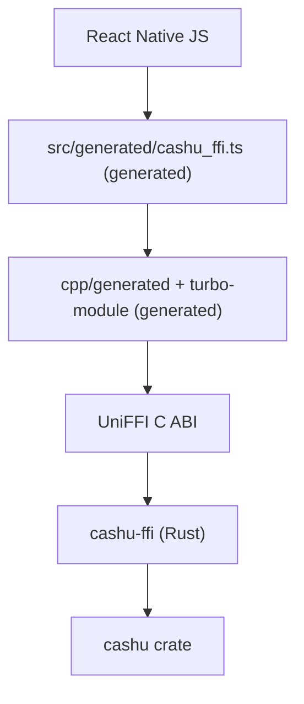

# @cashu/cashu-native

Native cashu crypto for React Native. The Rust [`cashu`](../../crates/cashu)
crate reaches JavaScript through [UniFFI][uniffi] and
[`uniffi-bindgen-react-native`][ubrn], and every layer between the two is
generated: the TypeScript, the JSI C++, the turbo-module glue, the podspec and
the Android build files.

It exists so [cashu-ts][cashu-ts] can hand its slowest work to Rust without
changing its public API. `NativeOutputDataCreator` implements cashu-ts's
`OutputDataCreator` interface, and a wallet opts in by passing it in.

## Using it

```ts
import { Wallet } from '@cashu/cashu-ts';
import { uniffiInitAsync } from '@cashu/cashu-native';
import { NativeOutputDataCreator } from '@cashu/cashu-native/creator';

await uniffiInitAsync();

const wallet = new Wallet(mint, {
  outputDataCreator: new NativeOutputDataCreator(),
});
```

The low-level bindings are available too, and the root entrypoint does not
import cashu-ts, so this path works without it installed:

```ts
import { createDeterministicOutputs } from '@cashu/cashu-native';

const outputs = createDeterministicOutputs([16n, 8n, 4n], seed, counter, keysetId);
```

cashu-ts is an optional peer dependency. Install it alongside this package only
if you import `@cashu/cashu-native/creator`.

Only output construction moves native. `toProof` stays on cashu-ts's own
`OutputData`, so the amount binding, DLEQ and NUT-28 checks that protect a
wallet against a malicious mint are the reviewed ones.

`NativeOutputDataCreator` falls back to cashu-ts for the locks the native
surface does not express: HTLC locks, NUT-28 blinded keys, and caller-supplied
extra tags. Pass your own fallback to the constructor to change that.

## Architecture



Only `src/creator.ts`, `src/NativeOutputDataCreator.ts` and the tests are
hand-written. Everything else under `src/generated/`, `cpp/`, `ios/`,
`android/`, plus `index.ts`, `NativeCashuNative.ts` and the podspec, is emitted
by `just binding-react-native` and is not committed.

## Working on it

```sh
just binding-react-native     # regenerate everything from the Rust exports
just test-react-native        # cargo tests, typecheck, and cashu-ts parity
just bench-react-native       # native vs cashu-ts
just binding-react-native-ios
just binding-react-native-android
```

The parity tests run the same generated bindings React Native gets, through
ubrn's N-API flavour, so they execute under plain Node with no simulator. They
assert the native path produces byte-identical blinded secrets, blinding
factors and secrets to cashu-ts's Noble-curves implementation.

**Build the crate in release.** A debug build of `cashu-ffi` is roughly half
the speed of cashu-ts; a release build is an order of magnitude faster. The
`just` recipes default to `--release` for this reason.

Measured on an M-series laptop against cashu-ts 5.0.0-rc.10:

| Workload | cashu-ts | native | |
|---|---|---|---|
| NUT-09 restore, 500 counters | 772 ms | 68 ms | 11.3x |
| Deterministic outputs for 1000 sat | 10.8 ms | 0.87 ms | 12.4x |

### Developing against a local cashu-ts

The tests run against the published `@cashu/cashu-ts` by default. To point them
at a sibling checkout instead:

```sh
cd ../../../cashu-ts && npm run compile && npm link
cd -                 && npm link @cashu/cashu-ts
```

`npm link` rather than a `file:` dependency, so there is one copy of cashu-ts
and one copy of its `Amount` and `OutputData` classes. Two copies make
cashu-ts's own identity checks fail on natively-created outputs, which is a
subtle and expensive thing to debug.

[uniffi]: https://mozilla.github.io/uniffi-rs/
[ubrn]: https://github.com/jhugman/uniffi-bindgen-react-native
[cashu-ts]: https://github.com/cashubtc/cashu-ts
